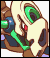

##  Vulturon 
Vulturon the Condorrock (from Megaman ZXA) as a Mugen char.  

## Gameplay
The character is a  simple character that lacks the ability to guard.  
Vulturon's direct attack options are limited and cannot perform combos.
Instead it deals most of his damage trough his summons.

He also has tools to keep the enemy in place via a charged attack, and a  strong attack that launches the enemy back.  
In addition, as a last resort, he has the ability to teleport away.

## Commands

### Normal Moves
- `a` = Jump
- `b` = Normal attack. 
- `c` = Strong attack. `Launch` `Ground only`
- `x` = Teleport. `Ground only`
  
### Unique Moves
- `a` = Glide `Air Only`
- `b > b > b` = Normal attack chain. `Air OK`

### Special Moves
- `x↴50` `x⬏` = Stun attack.
- `x↴50` `x⬏` = Triple Summon. `Air only`

## Extra notes
This is a very old char with very simple gameplay, not very high quality.  
The reason why it was uploaded it to show how to use GitHub to upload Mugen chars.

The symbol notation is as follow:
- `↴` = Hold.
- `⬏` = Release.
- `>` = No press other keys  between the previous and the current.
- `+` = Simultaneous press.
- `←, ↑, ↓, →` Arrow keys.
- `↙, ↖, ↗, ↘` Diagonal Arrows.
- `A, B, C, D, W, X, Y, Z` = Normal buttons.
- `Start` = The Start Key.
- `Menu` = The Menu key. (Ikemen Only)

A example:
- `↓` `↘` `→` `A` = QCF A
- `→` `↓` `→` `X` = Shotyuken motion.
